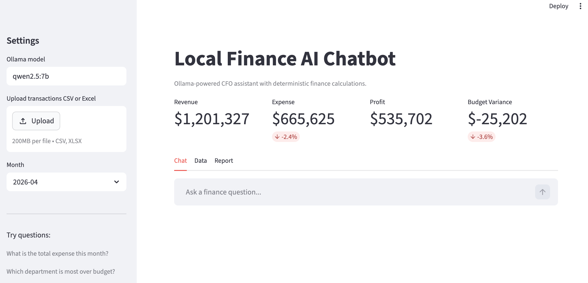
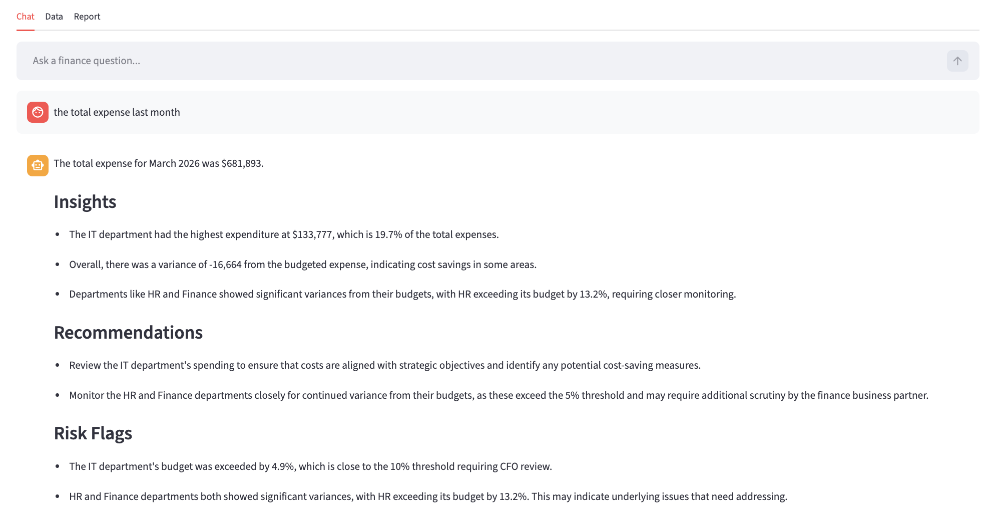
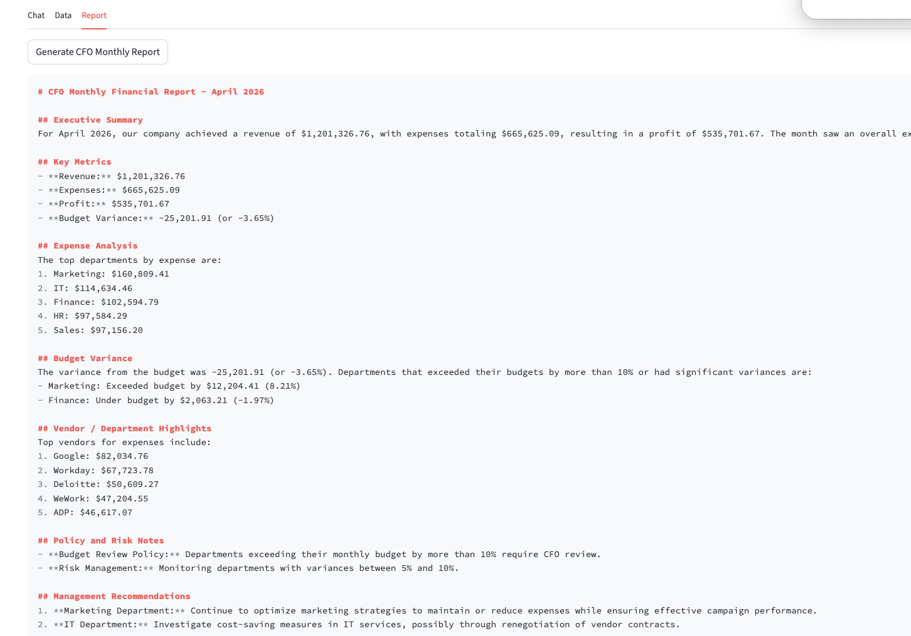

# Local Finance AI Chatbot

A local AI-powered finance assistant built with:

- Streamlit
- Pandas
- Ollama
- Qwen2.5

The app supports:

- Financial KPI analysis
- Budget variance tracking
- Vendor / department analysis
- AI-powered finance Q&A
- CFO-style report generation

By default, the application generates mock financial datasets for demo purposes.  
Users can also upload their own CSV or Excel files for analysis.

---

## Dashboard



## AI Chat



## Report



---

# Setup

## Install dependencies

```bash
pip install -r requirements.txt
```

## Start Ollama

```bash
ollama serve
```

## Pull model

```bash
ollama pull qwen2.5:7b
```

## Run app

```bash
streamlit run app.py
```

---

# Example Questions

- What is the total expense this month?
- Which department exceeded budget the most?
- Generate a CFO monthly report.
